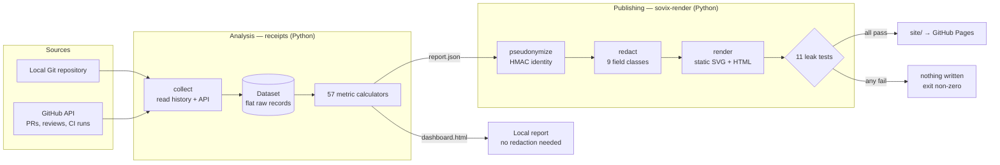
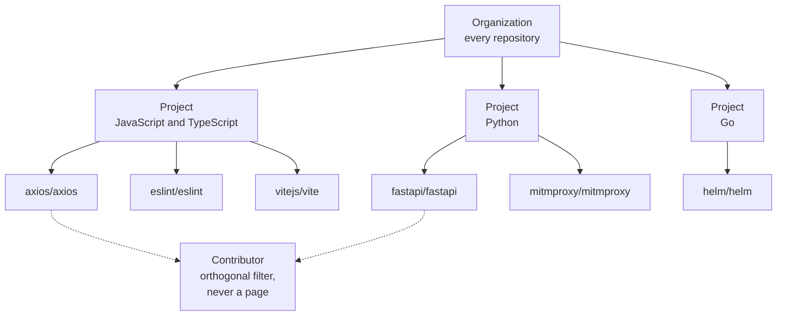
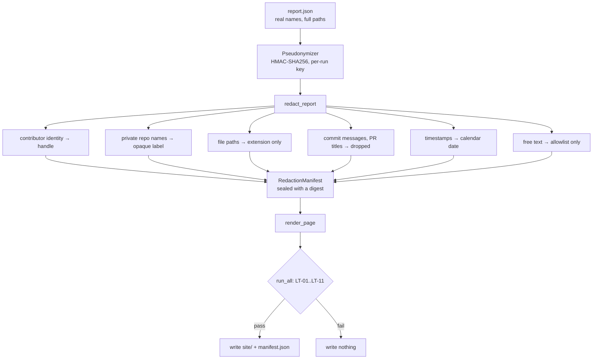

# Architecture

## The whole thing in one picture

Two programs, one handoff. `receipts` produces `report.json`. `sovix-render`
turns that into something safe to publish. The handoff is a documented JSON
schema, so either side can be replaced.

## Why analysis and publishing are separate

The local report and the published report have different threat models. A local
report is for you, about your own code, on your own machine — it can name
people, because you already know them. A published report is world-readable
forever.

Keeping them separate means the privacy machinery only exists on the path that
needs it, and the local tool stays useful with no configuration at all.

## The scope model

The rule that matters: **a metric at any level is recomputed from the union of
raw records at that level.** It is never averaged from the level below. A median
of medians is not a median, and a ratio of ratios is not a ratio.

This is why `Dataset` in the diagram above is a flat collection. Every scope is
a filter over the same records, and identical metric code runs against each
filter. Aggregating wrongly is therefore not possible, rather than merely
forbidden.

A repository in two projects is counted **once** at organization level. Project
figures can therefore legitimately sum to more than the organization figure, and
the interface says so instead of hiding it.

Contributor is an orthogonal filter, not a tier. It never gets its own published
page: a directory of per-person pages is a leaderboard however it is labelled.

## The publishing gate

Three properties hold here.

**The key never persists.** It is generated in-process, used, and discarded. The
published artifact cannot be de-pseudonymized from anything left behind.

**Free text uses an allowlist, not a denylist.** Only an allowlist is
mechanically checkable. A denylist is defeated by the next field added upstream.

**The gate is a gate.** A failure writes nothing and exits non-zero. In CI no
`continue-on-error` is set, so a failure stops the deploy rather than printing a
warning next to a published leak.

## The eleven leak tests

| | Checks |
|---|---|
| LT-01 | No email-shaped string |
| LT-02 | No known contributor name, address or handle, on token boundaries, excluding the product's own static vocabulary |
| LT-03 | No absolute filesystem path |
| LT-04 | No remote asset. `data:` URIs and same-document `#fragment` references are allowed; any absolute scheme fails |
| LT-05 | No secret-shaped material: token prefixes, long hex or base64 runs |
| LT-06 | Every machine-readable field key is on a structured allowlist |
| LT-07 | The manifest digest recomputes to its recorded value |
| LT-08 | No private repository identity. A repository declared public may keep its name |
| LT-09 | No raw non-default branch name |
| LT-10 | No contributor cohort below five. A handle in prose is a cohort of one and fails |
| LT-11 | The manifest was produced by the current redaction ruleset |

LT-09 currently has no data path to exercise it, because nothing in the model
carries a raw branch name. It is implemented and correct, and unverified against
real input. Treating it as tested would be wrong.

## Rendering

There is no charting library. Each chart form is a pure function that emits
static SVG, with headless scale maths only.

This is forced by one requirement: a published artifact must render correctly
with JavaScript disabled and must reference nothing remote. A hydrating library
cannot satisfy that, and adding a second renderer for publication would put the
console and the artifact out of step — which is the one thing that must not
happen, because a report that disagrees with its own export is worse than no
report.

The same function renders the console, the offline export and the published
page. Navigation is passed in as a parameter rather than forked into a separate
site renderer.

Deterministic output is a consequence and a test surface: the same input gives
byte-identical SVG, so a golden-file test catches an unintended visual change.

## Design system

Tokens live in `packages/renderer/src/sovix_render/tokens.py` as code, and
`tests/test_tokens.py` recomputes every accessibility claim from the hex values
rather than trusting a comment. That suite found two real defects on its first
run: a categorical palette whose blue, vermilion and slate sat within 0.001
relative luminance — three distinct colours on screen, one grey in print — and
an off-by-one in which ramp steps need a contrast boundary.

Evidence state is carried three times over: in words, in a pattern or stroke,
and in placement. Any single channel can fail without losing the meaning.

| State | Treatment |
|---|---|
| Measured | Solid |
| Proxy | 45° hatch, dashed stroke |
| Inferred | Stipple, dotted stroke |
| Partial | 135° hatch — the opposite orientation to proxy, so the two never read as each other |
| Unavailable | Blank, with the reason and the capability required |
| Suppressed | No value, no plotted position, no tooltip, no downloadable cell |

Direction is never encoded visually. No colour, arrow or sort derives from it,
because that would assert a judgment the evidence cannot support. A non-neutral
metric appends "(lower is generally preferred)" as text; the word "better" is
banned outright.
