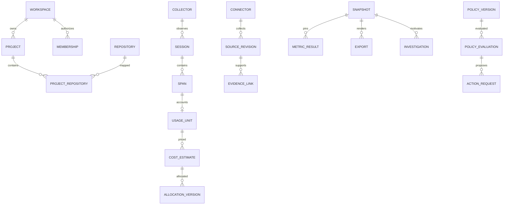

# Data Model

## Conventions

IDs are UUIDs generated by the platform. External IDs are opaque strings and never primary
keys without their connector namespace. UTC timestamps are RFC 3339; money is decimal-string
USD in v1 (six fractional digits internally), token counts are nonnegative integers. Dates
and costs never use JavaScript float arithmetic for aggregation. Every private row has
`workspace_id`; every project-owned row also has `project_id`. Foreign keys include these
scope columns. Mutable aggregates have `version`, `created_at`, `updated_at`; immutable
records have `recorded_at`, `schema_version`, `digest` and optional `supersedes_id`.

No contributor name, email, raw prompt, code body, tool arguments/output or local filesystem
path belongs in the normalized platform database. A source adapter may transiently parse
identity for aggregate counts inside the local trusted process; exports exclude it.

## Entity Catalog

| Entity | Required fields beyond scope/ID | Relationships and constraints |
|---|---|---|
| Workspace | name, slug, deployment_profile, status | Slug unique globally; profile local/hosted; last owner cannot be removed |
| User | oidc_issuer, oidc_subject, display_label, status | Unique issuer+subject; login identities separate from Git contributors |
| Membership | user_id, role, project_ids, status | Unique workspace+user; owner/admin all-project, analyst/viewer explicit grants or all-project flag |
| Project | name, slug, timezone, status | Unique workspace+slug; timezone is valid IANA; deletion fences project |
| Repository | connector_id nullable for local, host, host_repo_id, canonical_remote, default_branch, visibility, status | Unique workspace+host+host_repo_id; project mappings are effective-dated join rows |
| ProjectRepository | repository_id, project_id, valid_from, valid_until | No duplicate active pair; rollup uses unique repository/source IDs |
| Connector | kind, config_redacted, credential_ref, capabilities, status, last_attempt_at, last_success_at | Kinds github/local_git/legacy_import/otlp/deployment/incident; secret values never returned |
| Collector | connector_id, runtime, runtime_version, adapter_version, capability_manifest, token_hash, expires_at, revoked_at | Ingest-only scoped service principal; token plaintext returned once |
| ImportBatch | source_kind, schema_version, sanitized_digest, requested_window, input_artifact_id, status | Unique workspace+source_kind+digest; no arbitrary URL imports |
| IngestReceipt | connector_id, delivery_id, sanitized_digest, received_at, accepted_count, rejected_count, state | Unique workspace+connector+delivery; original webhook signature verified before sanitization |
| SourceRevision | connector_id, external_id, revision_key, kind, occurred_at, observed_at, source_url, sanitized_payload, digest | Unique workspace+connector+external_id+revision; edits append; URLs canonicalized |
| Job | type, resource_id, state, attempt, max_attempts, next_attempt_at, lease_until, fence, progress, error_code | Owner scope required; at most one active fenced lease; progress is safe counts |
| OutboxEvent | aggregate_id, aggregate_version, event_type, envelope, published_at | Unique aggregate+version+event_type; delivery at least once |
| Session | collector_id, external_session_id, runtime, repository_id nullable, started_at, ended_at nullable, state, coverage | Unique workspace+collector+external_session_id; duration is elapsed only |
| Span | collector_id, trace_id, span_id, parent_span_id nullable, session_id, kind, start_time, end_time, safe_attributes | Trace/span hex lengths 32/16; unique collector+trace+span; conflicting sanitized payload rejected |
| UsageUnit | session_id, owner_span_id, model_id, input_tokens, output_tokens, cache_read_tokens, cache_write_tokens nullable, accounting_status | Unique owner span; status canonical/included_in_parent/unknown; noncanonical units excluded from totals |
| PriceVersion | catalog, version, model_id, currency, effective_from, rates, unit_size, digest | Immutable; unknown model unpriced; USD only; cache semantics versioned |
| CostEstimate | usage_unit_id, price_version_id, amount_usd nullable, availability, billing_mode, formula | Unique usage+price; estimate never combined with billed ledger |
| BillingAllocation | source_revision_id, period, amount_usd, method, coverage | Separate optional admin-imported subscription/invoice allocation; not automatic measured labor or ROI |
| EvidenceLink | from_kind, from_id, to_kind, to_id, status, method, source_revision_ids, actor_id nullable, reason, link_version | Same scope; candidate/verified/rejected/superseded; analyst attestation explicitly labelled |
| AllocationVersion | cost_estimate_id, method, method_version, rows, source_link_versions, created_by | Rows target PR or unallocated, integer weight parts per million sum 1m; amounts sum exactly |
| MetricDefinition | metric_id, version, unit, kind, formula_id, eligibility_rule, required_capabilities, caveats | Unique metric_id+version; immutable published definitions |
| MetricResult | definition_id, scope, window, value nullable, availability, formula, inputs, sample, coverage, exclusions, evidence_refs, digest | Complete contract; unavailable/suppressed values null; digest excludes run timestamps |
| Snapshot | definition_id nullable, state, window, timezone, manifest_digest, input_revision_ids, metric_versions, allocation_versions, privacy_version | Building unpublished; ready/partial immutable; deletion invalidates content |
| ReportDefinition | name, project_ids, repository_ids, window_rule, view, allowed_granularity, version | Scope subset of creator permissions; ownership transfer/revocation handled before schedule runs |
| Schedule | report_definition_id, frequency, local_time, weekday nullable, timezone, enabled, next_run_at | Frequency daily/weekly/monthly; monthly day=1; one schedule per definition in v1 |
| ScheduleRun | schedule_id, slot_local_date, intended_timezone, effective_utc, job_id | Unique schedule+slot_local_date; DST overlap once, gap shift forward |
| Export | snapshot_id, format, state, manifest_digest, artifact_id, expires_at, revoked_at | format html/json/csv_bundle/markdown; authorized download gateway, no public URLs |
| Investigation | snapshot_id, finding_id, title, owner_user_id nullable, status, due_at nullable, resolution, version | Only authorized members can be assigned; comments append with sanitized text |
| AuditEvent | actor_id, action, resource_kind, resource_id, result, reason_code, occurred_at | Content-free, append only; 365-day default retention |
| RetentionPolicy | spans_days, evidence_days, exports_days, audit_days, version | Defaults 30/365/30/365; bounds defined in security.md |
| DeletionRequest | project_id, requested_by, state, cutoff_revision, fence, requested_at, completed_at, safe_counts | Project deletion only in v1; cannot reverse after fencing; tombstone contains no content |
| Deployment | source_revision_id, repository_id, revision_sha, environment, status, started_at, completed_at nullable, service_key | Immutable revisioned source; successful production attempts define deployment denominator |
| Incident | source_revision_id, service_key, severity, impact_started_at nullable, detected_at, recovered_at nullable, state | Distinct clocks; incident-deployment associations use EvidenceLink |
| PolicyVersion | policy_id, version, project_ids, repository_ids, rules, mode, action_allowlist, max_evidence_age_seconds, shadow_report_id nullable | draft/shadow/active/disabled; bounded rules only, no executable code |
| PolicyEvaluation | policy_version_id, repository_id, pr_number, head_sha, snapshot_id, result, rule_results, evaluated_at, expires_at | pass/fail/unknown; immutable exact head and input versions |
| ActionRequest | evaluation_id, action_type, expected_head_sha, state, approved_by, reason, host_delivery_id nullable | publish_check/merge_pr; unique evaluation+type; unknown result requires reconciliation |
| PublicRepositoryProfile | host_repo_id, owner_name, repo_name, visibility, facts, provenance, refreshed_at, lifecycle_status | Physically separate public store; no workspace_id or private joins |

## Relationships and Ownership

EvidenceLink is a typed polymorphic relationship whose referent existence and workspace
must be checked in the domain layer and DB constraint triggers where direct FKs are not
possible. Source revisions for commits, PRs, reviews and checks use validated kind-specific
payloads; no unvalidated arbitrary dictionaries may bypass adapters.

## Indexes and Storage

- Index every tenant-owned table by `(workspace_id, project_id, id)` as applicable.
- Source revisions: unique natural key plus `(workspace_id, kind, occurred_at, id)` pagination.
- Spans: unique identity and `(workspace_id, session_id, start_time, span_id)`; partition hosted
  spans by UTC day after pilot scale warrants it. No full-text index on private payloads.
- Jobs: `(state, next_attempt_at, lease_until)` partial index for runnable states; outbox index
  on unpublished rows. Scheduler uniqueness is enforced in DB, not only application locks.
- Snapshots: `(workspace_id, created_at, id)` and unique canonical digest scoped to inputs.
- Blob keys: opaque `workspace/project/artifact-id`, never source names or credentials.
  The object store is private and download authorization occurs in the API gateway.
- SQLite stores one local workspace; its integrity suite must match PostgreSQL semantics.
  Hosted application/worker roles must not own tables or have BYPASSRLS.

## Revision and Deletion Rules

Mutable display metadata uses optimistic concurrency. Changes to source facts, links,
prices, allocations, policy versions and published calculations append new revisions.
A snapshot lists every pinned revision and cannot silently advance to current source state.

Deletion is a lifecycle exception to retained content, not a rewrite of historical facts.
Project deletion sets a durable fence; rejects future writes; cancels jobs; removes source,
span, cost, metric, search and object payloads; revokes exports; marks affected multi-project
snapshots revoked; and retains content-free deletion/audit tombstones. Unaffected projects'
underlying records remain. A new workspace/project cannot reuse deleted IDs. Previously
downloaded files cannot be remotely erased and the user-facing deletion flow says so.
