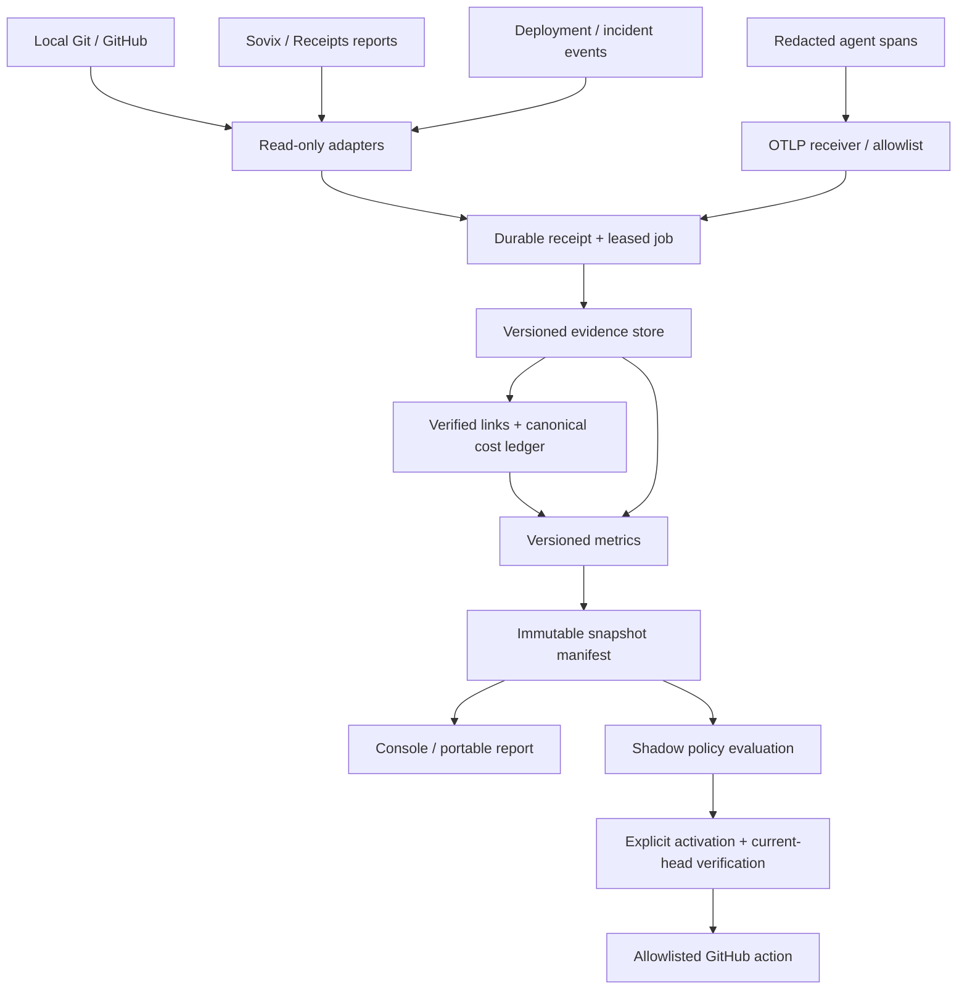

# Implementation Plan: Sovix Evidence Platform

**Branch**: `codex/001-sovix-evidence` | **Date**: 2026-09-11 | **Spec**: [spec.md](spec.md)

**Input**: Complete product specification in `specs/001-sovix-evidence/spec.md`.
Spec Kit's logical feature identifier is `001-sovix-evidence`; Git branch naming remains independent.

## Summary

Deliver one modular monorepo with a deterministic Python analytics/API backend, Node CLI,
Next.js console and isolated optional public discovery app. Preserve the existing scanner
and analytics logic behind adapters until parity fixtures establish safe consolidation.
Historical import and offline export ship before hosted telemetry. Production correlation
and policy enforcement are separately gated capabilities.

## Technical Context

| Concern | Selected baseline |
|---|---|
| Languages | Python 3.12; TypeScript on Node.js 24 LTS |
| Web | Next.js 16 / React 19; generated TypeScript REST client; accessible system-token components |
| Backend | FastAPI + Pydantic; SQLAlchemy 2 + Alembic; exact dependency patches locked at T001 |
| Hosted storage | PostgreSQL 17 with tenant RLS; S3-compatible object store for encrypted artifacts |
| Local storage | SQLite, local blob directory, same domain services; no hosted login |
| Async work | PostgreSQL leased jobs and transactional outbox; same-process worker for local mode |
| Telemetry | OTLP/HTTP receiver or OTel Collector; versioned Dash0 normalizer, metadata allowlist |
| Identity | Hosted OIDC authorization code + PKCE through web BFF; API validates audience-bound JWT |
| Tests | pytest + Hypothesis, JSON Schema/OpenAPI validation, Vitest, Playwright, axe |
| Packaging | pnpm workspace for JS; uv workspace/lock for Python; OCI images for API/worker/web |
| Deployment | Docker Compose for pilot/self-host; managed equivalent is supported through same images |
| Scale | Initial target: 50 repos, 100k source revisions, 1m spans/workspace/day |
| Performance | Overview p95 2s, evidence p95 1s, accepted spans queryable p95 60s |
| Constraints | No model calls in calculations; offline HTML; metadata-only telemetry; no public private-data sync |

These are implementation targets, not claims that dependencies or application services are
already installed. Use current compatible security patch releases and commit lockfiles
before implementation; changes to a major version require an ADR and contract regression.

## Constitution Check

| Principle | Design gate | Result at design stage |
|---|---|---|
| I Evidence | Metric schema plus canonical manifests and source revisions | Covered by contracts, metrics and acceptance documents |
| II Limits | Separate evidence kind/availability; candidate joins excluded | Covered by domain invariants and golden scenarios |
| III Privacy | Metadata allowlist, aggregate views, isolated public store | Covered by security and UI specifications |
| IV Contracts | OpenAPI, JSON Schemas, event/CLI contracts and fixtures | Must pass repository validation before delivery |
| V Actions | Shadow first; exact-head revalidation; bounded action types | Covered by policy specification |
| VI Tests | Risk-bearing invariants and story end-to-end acceptance | Task backlog requires these before each milestone |
| VII Simplicity | Modular backend and job worker, no message broker initially | No exception required |

Pre-design and post-design review found no required constitutional exception. Implementation
and operational gates are not marked passed merely because this plan describes them.

## Project Structure

### Documentation (this feature)

`spec.md`, `plan.md`, `research.md`, `data-model.md`, `domain.md`, `metrics.md`, `security.md`,
`ux-spec.md`, `operations.md`, `integrations.md`, `policy.md`, `migration.md`, `quickstart.md`,
`tasks.md`, `traceability.json`, `acceptance.md`, `contracts/`, `checklists/`.

### Source Code (planned, not implemented)

```text
apps/console/                    # Authenticated project/report workspace
apps/radar/                      # Optional public discovery surface
packages/scanner/                # Existing Node Git scanner preserved behind adapter
packages/contracts/              # Generated types; authoritative specs stay under contracts/
packages/ui/                     # Evidence components and Receipts-derived tokens
services/platform/src/sovix/
  api/                          # Versioned routes and request validation
  domain/                       # Evidence, cost, access and lifecycle rules
  adapters/                     # Sovix, Receipts, GitHub, Dash0, deployment, incident
  analytics/                    # Versioned calculators and metric registry
  reporting/                    # Snapshots, canonical manifests and offline rendering
  workers/                      # Leased jobs, outbox, schedules and cleanup
  persistence/                  # Repository interfaces, SQLite/Postgres mappings
  policy/                       # Bounded evaluator and guarded action runner
services/platform/migrations/    # Additive schema migrations and rollback guidance
infra/                          # Compose, OTel receiver, backup and deployment config
fixtures/                       # Synthetic/redacted fixtures only
scripts/                        # Spec validation now; build/migration tools later
tests/contract/                 # Shared interface and compatibility acceptance
tests/integration/              # Real Git/DB/queue/auth boundaries
tests/e2e/                      # Browser and CLI user journeys
```

**Structure Decision**: A single platform backend owns transactions, tenancy, evidence and
jobs. The worker uses the same package in a separate process. Node handles the scanner and
browser ecosystem. Public discovery has separate data credentials and no direct private DB
connection. No Kafka, Kubernetes or graph database is required for the first milestones.

## Data Flow



All private arrows carry authenticated workspace/project context derived at entry. User-
supplied labels and repository content never become authorization or executable instructions.

## Implementation Phases

1. **M0 — Foundations**: Pin dependencies, generate contract types, implement tenant context,
   DB migrations, job lease/outbox primitives, redaction and synthetic reference fixtures.
2. **M1 — Historical baseline**: Wrap existing CLI and Python logic, import legacy report
   snapshots, implement reproducible metrics, evidence UI and offline exports. Do not infer
   raw records from summary metrics. This is the first demonstrable local product.
3. **M2 — Workspace and telemetry**: Implement hosted access, explicit GitHub installations,
   collector registration, OTLP normalization, verified/candidate links and cost allocation.
4. **M3 — Reporting operations**: Saved definitions, schedule slots, inbox, investigations,
   entitlements, source-health views, retention/deletion and verified restore.
5. **M4 — Outcomes and control**: Explicit release/incident adapters, mature comparisons,
   policy shadow reports, optional check publication and bounded merge actions.
6. **M5 — Discovery**: Public-only collector, profiles/search/watchlist and explicit repository
   requests. Public enrichment is an optional model-consuming adapter outside analytics.

## Transaction and Concurrency Design

- Durable receipt insert and outbox enqueue share a transaction. Receipt uniqueness prevents
  duplicate effects while job state distinguishes received from processed.
- Workers claim rows with a lease and fencing token. Every checkpoint/output write validates
  the active fence. Expired workers cannot overwrite successors.
- Snapshot assembly pins source revision IDs and calculator versions before rendering;
  publish its manifest atomically after all required computation finishes.
- Mutable resources use strong ETags. Stale If-Match produces 412; omitted required If-Match
  produces 428. Idempotency key reuse with a different request digest produces 409.
- Deletion establishes a project write fence, cancels/resolves jobs and purges derivatives.
  No later job may republish a fenced project's old data.
- Policy actions re-fetch GitHub state and send the expected head SHA with merge requests;
  reconcile uncertain responses before retrying. A network timeout is not success.

## Risks and Mitigations

| Risk | Concrete mitigation |
|---|---|
| Metric drift between engines | Versioned registry, golden parity, legacy adapter with explicit scope capabilities |
| Telemetry parent/subagent double-count | Canonical usage owner and `included_in_parent` accounting status |
| False session/PR association | Separate candidate edges, verified source membership and analyst attestation |
| Incomplete collection looks complete | Distinct eligibility, collection and instrumentation coverage fields |
| Sensitive content in error strings | Ingest allowlist; discard unknown/error text, retain normalized error class |
| Stale-head merge race | Expected SHA enforced at action boundary; host protections remain authoritative |
| Unbounded raw trace storage | Explicit retention/quota and decompressed request limits; storage growth alarms |
| Tenant leakage via cached exports | Authorization on each download; private object prefixes, revocation-aware gateway |
| Local/hosted implementation divergence | Shared domain fixtures with separate persistence conformance tests |

## Complexity Tracking

No approved constitutional violations. SQLite/PostgreSQL dual adapters are justified by
local offline operation; their semantic differences require conformance tests. Three
languages are avoided: upstream Dash0 Go collector remains a pinned external dependency,
not a third maintained platform backend.
